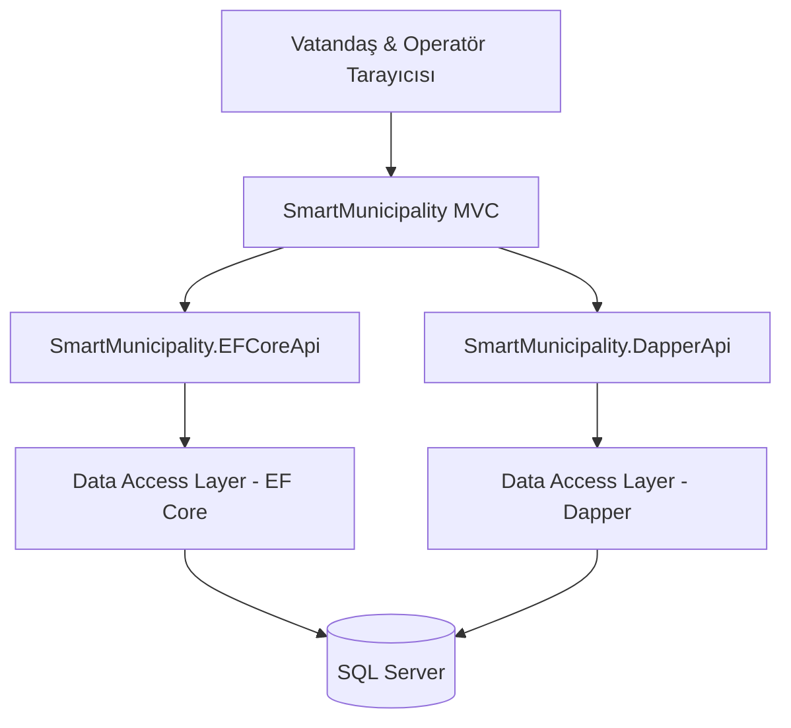
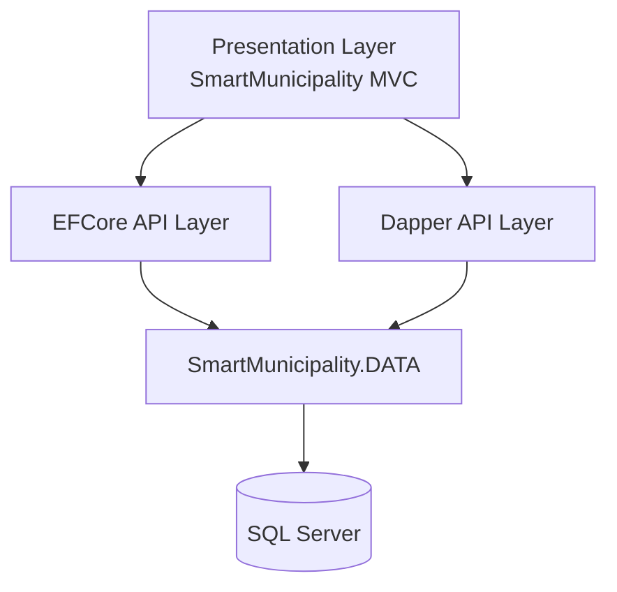
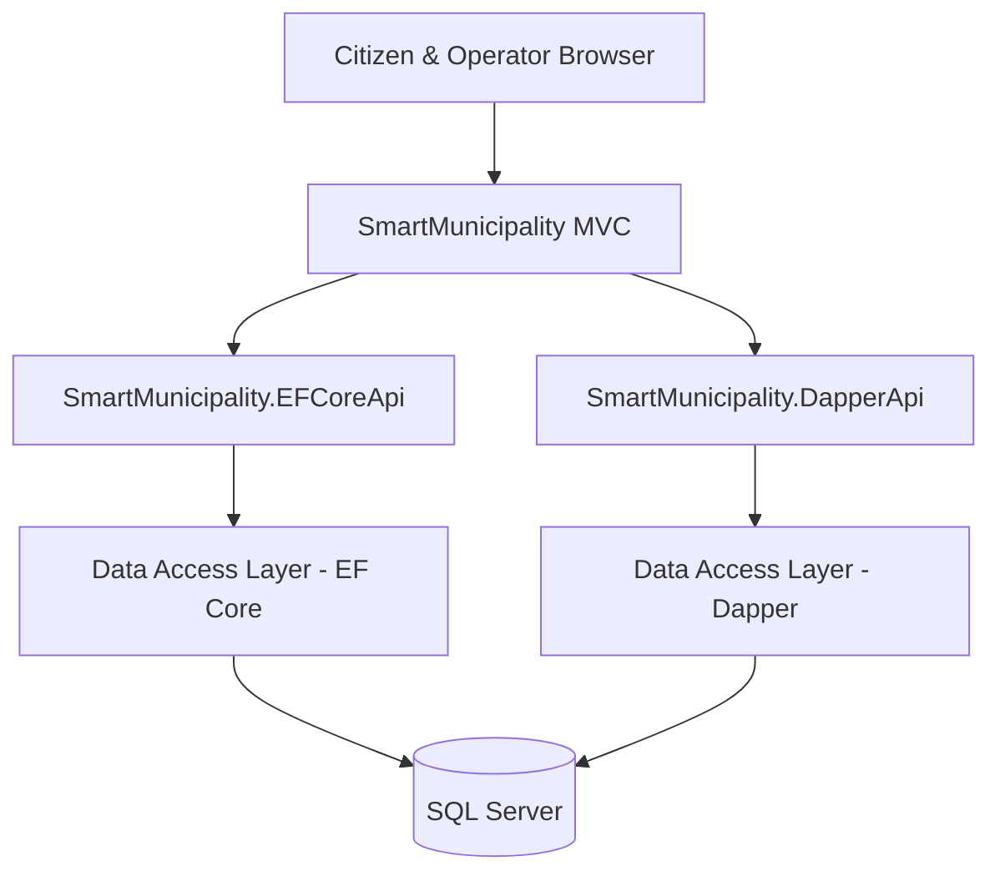

<h1 align="center">🏛️ SmartMunicipality</h1>

<p align="center">
  <strong>Next-Generation Smart Municipality Management Platform / Yeni Nesil Akıllı Belediye Yönetim Platformu</strong><br>
  SoftITO Backend Developer Eğitimi kapsamında geliştirilen bitirme projesidir. / Developed as the graduation project under the SoftITO Backend Developer Training program.
</p>

<p align="center">
  
  
  
  
  
  
  
  
  
  
  
</p>

<p align="center">
  <a href="#-türkçe">🇹🇷 Türkçe</a> • <a href="#-english">🇬🇧 English</a>
</p>

---

# 📸 Screenshots

> *SmartMunicipality'nin temel modüllerine ait ekran görüntüleri.*

### 🔐 Login / Giriş Yap
<p align="center">

</p>

### 📊 Dashboard / Yönetici Paneli
<p align="center">

</p>

### 💧 Subscription Management / Abonelik Yönetimi
<p align="center">

</p>

### 💵 Bill Management & Payment / Fatura Yönetimi ve Ödeme
<p align="center">

</p>

### ⚠️ Complaint Submission & Tracking / Şikayet Bildirimi ve Takibi
<p align="center">

</p>

### 📢 Announcements / Duyurular ve Haberler
<p align="center">

</p>

### 🤖 AI Chatbot / Yapay Zeka Belediye Asistanı
<p align="center">

</p>

---

# 🇹🇷 Türkçe

## 📖 Proje Hakkında

SmartMunicipality, modern belediyecilik süreçlerini dijitalleştirerek vatandaşlar ile yerel yönetim arasındaki iletişimi ve hizmet akışını optimize etmek amacıyla geliştirilmiş *kurumsal düzeyde bir Akıllı Belediye Yönetim Platformudur*.

Proje; katmanlı mimari, bağımsız API servisleri, rol bazlı yetkilendirme, hibrit veri erişim katmanı (EF Core & Dapper) ve yapay zeka entegrasyonu gibi modern yazılım desenleri kullanılarak inşa edilmiştir.

*Sistem, üç temel katman ve servis üzerinden çalışmaktadır:*
- **SmartMunicipality MVC**: Kullanıcıların ve operatörlerin etkileşime girdiği web arayüzü sunum katmanı.
- **SmartMunicipality.EFCoreApi**: CRUD işlemleri, kullanıcı yönetimi (Identity), JWT üretimi ve veri manipülasyonu için geliştirilmiş ana API katmanı.
- **SmartMunicipality.DapperApi**: Raporlama, gösterge paneli istatistikleri ve yüksek performans gerektiren okuma sorguları için geliştirilmiş Dapper API katmanı.

## 🏗️ Sistem Mimarisi

Sistem, gevşek bağlı (loosely coupled) ve REST API'ler aracılığıyla haberleşen servis tabanlı bir mimariye sahiptir.



## 🏛️ Katmanlı Mimari (Layered Architecture)

Uygulama, sorumlulukların net bir şekilde ayrıldığı N-Tier (Çok Katmanlı) mimariyi takip eder.



## 🔄 İstek Akışı (Request Flow)

Sunum katmanı (MVC), veritabanı ile asla doğrudan iletişim kurmaz. Tüm işlemler ve veri okuma/yazma süreçleri EFCore ve Dapper API uç noktaları (Endpoints) üzerinden yönlendirilir.

## 📊 Raporlama ve Gösterge Paneli Mimarisi

Hızlı ve optimize edilmiş sorgular için Dapper ve Stored Procedure'ler (Saklı Yordamlar) tercih edilmiştir:
- `sp_GetDashboardStats` (Genel İstatistik Raporu)
- `sp_GetComplaintsByCategory` (Kategorilere Göre Şikayetler)
- `sp_GetComplaintsByDistrict` (İlçelere/Mahallelere Göre Şikayetler)
- `sp_GetMonthlyRevenue` & `sp_GetYearlyRevenue` (Aylık/Yıllık Gelir Grafikleri)
- `sp_GetHeatMapData` (Şikayet Yoğunluk Haritası Verisi)
- `sp_GetComplaintsByStatus` (Durumlarına Göre Şikayet Grafiği)

## 🤖 Yapay Zeka Destekli Asistan Servisi

Sistem bünyesinde barındırdığı `AIService` ile vatandaşların su/doğalgaz abonelikleri, faturalar, şikayet süreçleri ve vergiler hakkındaki sorularını yanıtlayan akıllı bir belediye asistanı sunar. Servis:
- **Gemini API** (`gemini-1.5-flash`) entegrasyonu
- **OpenAI API** (`gpt-3.5-turbo`) entegrasyonu
- Servislerin çalışmadığı durumlar için gelişmiş yerel Türkçe doğal dil çıkarım (Fallback) mekanizması içerir.

---

## 🌟 Öne Çıkan Özellikler

- **ASP.NET Core 8.0**: Çok katmanlı ve ölçeklenebilir temiz mimari yapısı.
- **EF Core & Dapper Hibrit ORM**: Yazma ve ilişkisel işlemler için EF Core, yüksek performanslı raporlama okumaları için Dapper.
- **Güvenlik & Rol Yetkilendirme**: ASP.NET Core Identity altyapısı, JWT (JSON Web Tokens) ile güvenli API iletişimi, Rol Bazlı Yetkilendirme (Vatandaş ve Operatör rolleri).
- **Abonelik Yönetimi**: Su, doğalgaz, elektrik vb. abonelik başvuruları ve onay süreçleri.
- **Fatura ve Ödeme**: Otomatik fatura oluşturma, fatura detayları ve sanal pos ile ödeme entegyonu.
- **Akıllı Şikayet Yönetimi**: Harita/Konum destekli şikayet kaydı oluşturma, durum güncelleme ve operatör yönlendirmesi.
- **Anlık Bildirimler**: Şikayet güncellemeleri ve önemli olaylar için anlık bildirim sistemi.
- **Rapor Dışa Aktarma**: PDF çıktıları (QuestPDF) ve Excel listeleri (EPPlus) olarak veri aktarma.
- **Yapılandırılmış Günlükleme**: Serilog entegrasyonu ve dosya tabanlı loglama.

## 👥 Yetkilendirme Matrisi

| Modül | Vatandaş (Citizen) | Operatör (Operator) |
|---|:---:|:---:|
| Fatura Görüntüleme & Ödeme | ✅ | ✅ |
| Şikayet Oluşturma & Takip | ✅ | ✅ |
| Yapay Zeka Asistanı | ✅ | ✅ |
| Abonelik Başvurusu | ✅ | ✅ |
| Şikayet Durumu Güncelleme & Cevaplama | ❌ | ✅ |
| Abonelik Onaylama & Fatura Oluşturma | ❌ | ✅ |
| Raporlar & İstatistikler | ❌ | ✅ |

## ⚙️ Kurulum

```bash
# Projeyi klonlayın
git clone <repository-url>
cd SmartMunicipality

# Veritabanını oluşturmak için EF Core migrasyonlarını uygulayın
dotnet ef database update --project SmartMunicipality.DATA --startup-project SmartMunicipality.EFCoreApi

# Projeyi çalıştırın (Visual Studio üzerinde Çoklu Başlangıç Projesi / Multiple Startup Projects olarak ayarlayın)
# Çalıştırılacak Servisler: SmartMunicipality.EFCoreApi, SmartMunicipality.DapperApi ve SmartMunicipality (MVC)
```

---

# 🇬🇧 English

## 📖 About the Project

SmartMunicipality is an enterprise-level Smart Municipality Management Platform built to digitalize modern municipal processes, optimizing communication and service delivery between citizens and local government.

The project is built on modern software architecture patterns, utilizing layered structure, independent API services, role-based authorization, a hybrid data access layer (EF Core & Dapper), and artificial intelligence integration.

*The system operates across three core layers and services:*
- **SmartMunicipality MVC**: The user-facing web presentation layer where citizens and operators interact.
- **SmartMunicipality.EFCoreApi**: The main API layer responsible for CRUD operations, user management (Identity), JWT token generation, and data manipulation.
- **SmartMunicipality.DapperApi**: A lightweight API layer powered by Dapper for analytical reports, dashboard statistics, and high-performance read queries.

## 🏗️ System Architecture

The system utilizes a service-oriented, loosely coupled architecture communicating via REST APIs.



## 🏛️ Layered Architecture

The application adopts an N-Tier architecture with clean separation of concerns.


## 🔄 Request Flow

The MVC presentation layer never queries the database directly. All read/write operations go through EFCore and Dapper API endpoints.

## 📊 Reporting and Dashboard Architecture

Dapper and Stored Procedures are preferred for rapid, optimized reporting:
- `sp_GetDashboardStats` (Overall Municipal Stats)
- `sp_GetComplaintsByCategory` (Complaints grouped by category)
- `sp_GetComplaintsByDistrict` (District-wise complaints distribution)
- `sp_GetMonthlyRevenue` & `sp_GetYearlyRevenue` (Monthly/Yearly Revenue charts)
- `sp_GetHeatMapData` (Complaint density data for GIS heat maps)
- `sp_GetComplaintsByStatus` (Complaint status distribution)

## 🤖 AI-Powered Assistant Service

Equipped with an integrated `AIService`, the platform provides an AI-powered conversational assistant to guide citizens through subscription processes, bills, complaint submissions, and taxes. The service integrates:
- **Gemini API** (`gemini-1.5-flash`)
- **OpenAI API** (`gpt-3.5-turbo`)
- Local rule-based Turkish Natural Language Processing fallback mechanism for offline scenarios.

---

## 🌟 Key Features

- **ASP.NET Core 8.0**: Clean, multi-layered, and scalable architectural foundation.
- **EF Core & Dapper Hybrid ORM**: EF Core for transactional writes and entity mappings; Dapper for lightning-fast reads.
- **Security & Authorization**: ASP.NET Core Identity integration, JWT token-based API authentication, and Role-Based Access Control (Citizen & Operator roles).
- **Subscription Management**: Application and approval pipelines for water, gas, electricity, and other municipal utility services.
- **Billing & Payments**: Automated bill generator, detailed invoice views, and secure mockup credit card checkout.
- **Smart Complaints Portal**: Geolocation-aware complaint registration, workflow tracker, and operator routing.
- **Instant Notifications**: Real-time push updates for ticket status changes.
- **Document Export**: PDF exports (QuestPDF) and Excel sheet exports (EPPlus).
- **Structured Logging**: Diagnostic logging and file sinks powered by Serilog.

## 👥 Authorization Matrix

| Module | Citizen | Operator |
|---|:---:|:---:|
| View & Pay Bills | ✅ | ✅ |
| Submit & Track Complaints | ✅ | ✅ |
| AI Chatbot Helper | ✅ | ✅ |
| Apply for Subscriptions | ✅ | ✅ |
| Update/Resolve Complaints | ❌ | ✅ |
| Approve Subscriptions & Generate Bills | ❌ | ✅ |
| Reports & Statistics Dashboard | ❌ | ✅ |

## ⚙️ Installation

```bash
# Clone the repository
git clone <repository-url>
cd SmartMunicipality

# Apply EF Core migrations to create the database
dotnet ef database update --project SmartMunicipality.DATA --startup-project SmartMunicipality.EFCoreApi

# Run the project (Set Multiple Startup Projects in Visual Studio)
# Start: SmartMunicipality.EFCoreApi, SmartMunicipality.DapperApi, and SmartMunicipality (MVC)
```

---

# 📜 License & Developer

This project was developed for educational purposes as a graduation project.

*Developer:* Melis Yanık  
Backend Developer (.NET)

<p align="center">
⭐ If you found this project useful, don't forget to leave a star.<br>
Made with ❤️ using ASP.NET Core 8.0
</p>
